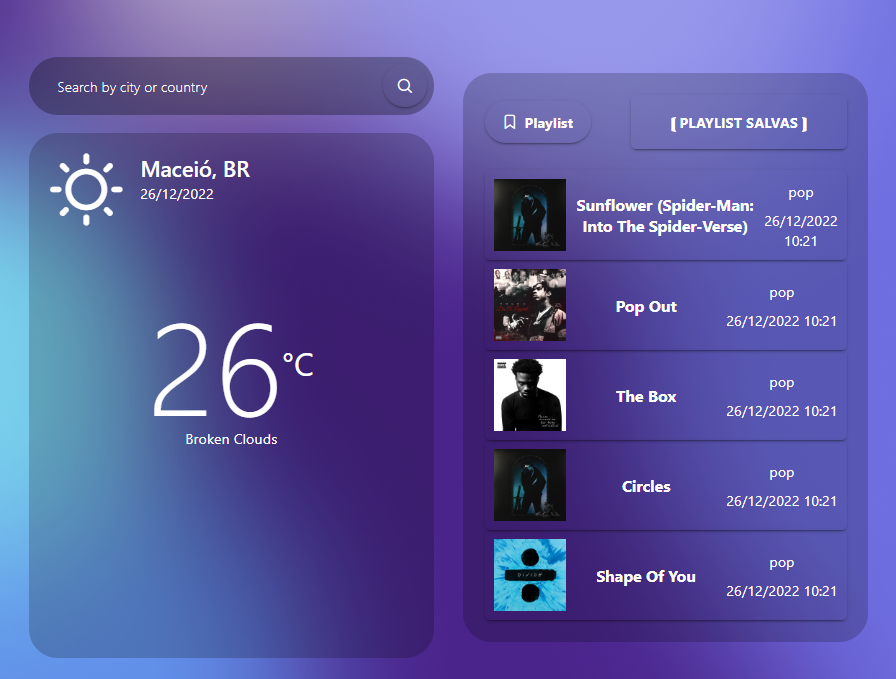
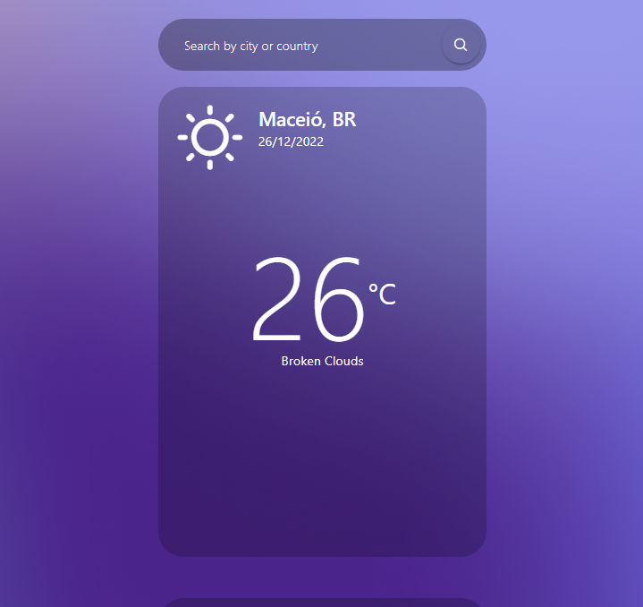
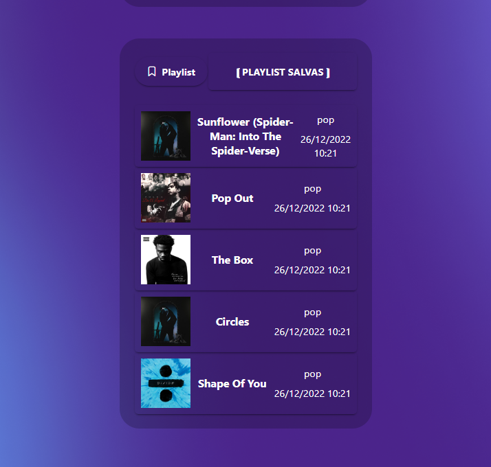

# Musical Weather Forecast | Teste Técnico 
 

<h2>Índice</h2>

- [Visão-Geral](#visao-geral)
  - [O Projeto](#o-projeto)
  - [Captura de Tela](#captura-tela)
  - [Links](#links)
- [Meu Processo](#meu-processo)
  - [Construído com](#construido-com)
- [Autor](#autor)

 
<h2 id="visao-geral"><strong>« [Visão-Geral] »</strong></h2>
 

<h3 id="o-projeto"><strong>Objetivo:</strong></h3>

> Consumo de API externas, à partir de documentação.
>
> Salvar as informações somente no storage do navegador (Não utilizar backend e/ou banco de dados).
>
> Estrutura de projeto (Componentes, etc). O projeto deve ser feito em ANGULAR.
>

<h3><strong>Descrição:</strong></h3>

> Dada uma localização (Cidade, latitude, longitude, etc) a aplicação deverá buscar na API de tempo (Weather API ou afins) a temperatura relativa da localização e assim que retornada a resposta deverá ser solicitada para à API de músicas (Shazam API ou afins) a lista de músicas recomendadas para o clima atual.
>
> ● Caso a temperatura seja maior que 32 graus, deverá retornar Rock;
>
> ● Caso a temperatura seja menor que 32 e maior 24, deverá retornar Pop;
>
> ● Caso a temperatura seja menor que 24 e maior que 16, devera retornar Classica;
>
> ● E caso a temperatura seja menor que 16, deverá retornar Lofi.
>
> Assim que retornado à lista de música, caso seja do agrado da pessoa, poderá ser salva no storage do navegador com a data de busca, a lista de músicas, à temperatura, à cidade e a categoria das músicas.
>
> Deverá haver uma página mostrando a listagem das músicas por data salva no storage.
>
> As listas podem ser deletadas.

<h3><strong>Apis recomendadas:</strong></h3>

>
> ● https://openweathermap.org/current
>
> ● https://rapidapi.com/apidojo/api/shazam
>

 
<h3 id="captura-tela"><strong>Captura de Tela</strong></h3>

• Aplicação  

 
<h3 id="links"><strong>Links</strong></h3>

- Live Site URL: [Click-me](https://vercel.app/)

 
<h2 id="meu-processo"><strong>« [Meu Processo] »</strong></h2>

<h3 id="construido-com"><strong>Construído com</strong></h3>

- HTML5 semântico para marcação
- CSS para a estilização
- Flexbox
- JS-TS - Linguagem de programação
- [Angular](https://angular.io/) - Biblioteca JavaScript
- [PrimeNG](https://www.primefaces.org/primeng/) - Provedor líder de bibliotecas de componentes UI

 
<h2 id="autor"><strong>« [Autor] »</strong></h2>

- LinkedIn - [@GustavoSilva](https://www.linkedin.com/in/guga-silva-124706233/)
- Whatsapp - [+55 (82) 9 8752-4230](https://wa.me/558287524230) or [+55 (82) 9 8182-8018](https://wa.me/558281828018)
- Instagram - [@50repolhoscozidos](https://www.instagram.com/50repolhoscozidos/)
- Telegram - [@GugaS1lva](https://t.me/GugaS1lva)
- Email - [contatogustavosilva017@outlook.com](mailto:contatogustavosilva017@outlook.com)
